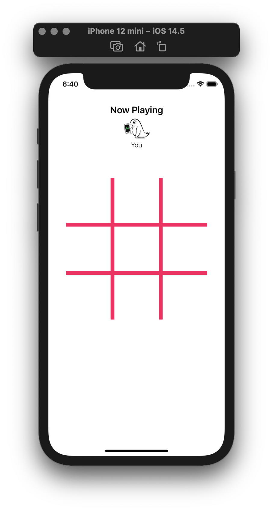
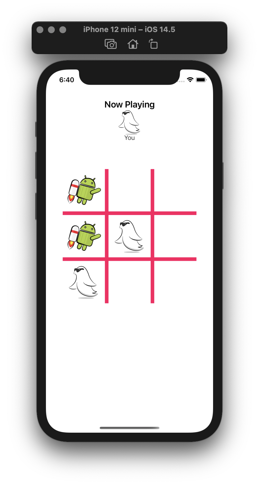
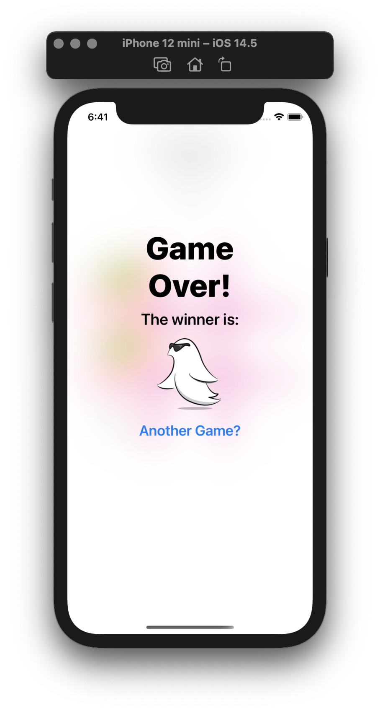

# Learn Nimble and Quick
Learn BDT (Behavior Driven Testing) using Nimble and Quick. The full tutorial could be found here: https://www.raywenderlich.com/135-behavior-driven-testing-tutorial-for-ios-with-quick-nimble

### Preview
&nbsp;
&nbsp;
&nbsp;
